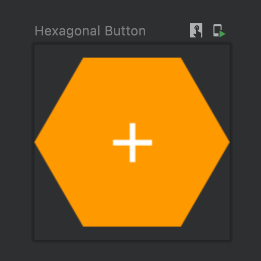

# Compose animations codelab I

## Part I

First, we will create the button that we will use for the menu items, using a custom shape.

Using the `GenericShape` constructor, and applying basic trigonometry, we will obtain our [HexagonShape](app/src/main/java/dev/fabirt/composeanimationscodelab1/ui/theme/Shape.kt).

Then, create the composable for the button, using a `Box` to arrange content and the `clip` modifier with our `HexagonShape`. 
[Browse here.](app/src/main/java/dev/fabirt/composeanimationscodelab1/ui/component/HexagonalButton.kt)

### Result

### More

- [Compose animations cheat sheet](https://storage.googleapis.com/android-stories/compose/Compose_Animation_Cheat_Sheet.pdf)
- [Philipp Lackner Compose Animations YT tutorial](https://youtu.be/6ZZDPILtYlA)
