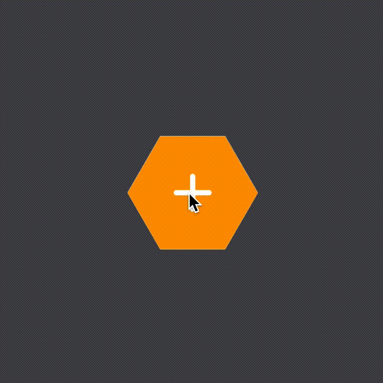

# Compose animations codelab I

## Part II

Here we will create our stack of buttons and the corresponding animations.

First, define a data class to hold menu items data. Define a list of dummy items to fill the menu. [AnimatedMenuItem](app/src/main/java/dev/fabirt/composeanimationscodelab1/ui/model/AnimatedMenuItem.kt).

```kotlin
data class AnimatedMenuItem(
    val imageVector: ImageVector,
    val onClick: () -> Unit
)
```

```kotlin
val dummyMenuItems = listOf(
    AnimatedMenuItem(Icons.Rounded.Home) { },
    AnimatedMenuItem(Icons.Rounded.Notifications) { },
    AnimatedMenuItem(Icons.Rounded.Email) { },
    AnimatedMenuItem(Icons.Rounded.ShoppingCart) { },
    AnimatedMenuItem(Icons.Rounded.Call) { },
    AnimatedMenuItem(Icons.Rounded.Search) { },
)
```

Now, we will stack 7 buttons, using `Box`, 6 from the list and 1 to toggle the state, which will be always visible.

The state controller will be a float, which will go from 0 (collapsed state) to 1 (expanded state). To control the menu state,
the composable will receive a boolean parameter.

```kotlin
val currentState by animateFloatAsState(
    targetValue = if (isCollapsed) COLLAPSED_STATE else EXPANDED_STATE,
    animationSpec = tween(
        durationMillis = 400,
        easing = LinearEasing
    )
)
```

Mapping the items list, we can assign a different angle for each button. Using `absoluteOffset` modifier, we can transform
the position of each button.

```kotlin
items.mapIndexed { index, item ->
    HexagonalButton(
        size = BUTTON_SIZE,
        onClick = item.onClick,
        color = Color.White,
        modifier = Modifier.absoluteOffset(
            x = (currentState * (BUTTON_SIZE + 4) * cos((60f * index - 90).toRadians())).dp,
            y = (currentState * (BUTTON_SIZE + 4) * sin((60f * index - 90).toRadians())).dp
        )
    ) {
        Icon(
            imageVector = item.imageVector,
            contentDescription = null,
            tint = Alto,
            modifier = Modifier.size(32.dp)
        )
    }
}
```

Finally, the toggle icon will rotate from 0 to 135 degrees. [AnimatedMenu.](app/src/main/java/dev/fabirt/composeanimationscodelab1/ui/component/AnimatedMenu.kt)

```kotlin
val iconRotation = currentState * 135f
```

```kotlin
HexagonalButton(
    size = BUTTON_SIZE,
    onClick = {
        onChange(isCollapsed)
    }
) {
    Icon(
        imageVector = Icons.Rounded.Add,
        contentDescription = null,
        tint = Color.White,
        modifier = Modifier
            .size(40.dp)
            .rotate(iconRotation)
    )
}
```

### Result



### More

- [Compose animations cheat sheet](https://storage.googleapis.com/android-stories/compose/Compose_Animation_Cheat_Sheet.pdf)
- [Philipp Lackner Compose Animations YT tutorial](https://youtu.be/6ZZDPILtYlA)
